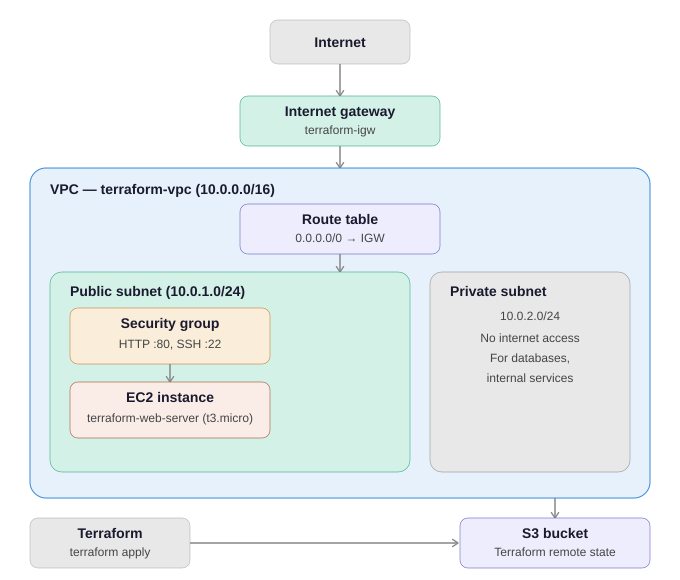

# Automated AWS Infrastructure Provisioning using Terraform

## Overview
This project provisions a complete, production-grade AWS cloud infrastructure using Terraform (Infrastructure as Code). All resources are created automatically with a single command — no manual clicking in the AWS Console.

## Live Demo
Access the live web application: http://terraform-web-alb-812605928.ap-south-1.elb.amazonaws.com

## Architecture


- VPC with CIDR block 10.0.0.0/16
- Public Subnets (x2) with Internet access
- Private Subnet for internal resources
- Internet Gateway for public internet access
- Route Tables associated with Public Subnets
- Security Group allowing HTTP (80) and SSH (22)
- EC2 Instance (t3.micro) running Nginx web server
- Application Load Balancer distributing traffic
- Auto Scaling Group (min:1, max:3 instances)
- CloudWatch Alarms for intelligent auto scaling
- S3 Bucket for remote Terraform state with versioning

## Tech Stack
- **Terraform** v1.15.2
- **AWS** (VPC, EC2, ALB, ASG, CloudWatch, S3, IAM)
- **Nginx** web server
- **Git & GitHub**

## Project Structure

## How to Run

### Prerequisites
- Terraform installed
- AWS CLI configured with IAM user credentials

### Steps
```bash
# Initialize Terraform
terraform init

# Preview infrastructure
terraform plan

# Create infrastructure
terraform apply

# Destroy infrastructure (keeps S3 bucket)
terraform destroy
```

## Resources Created
| Resource | Name | Purpose |
|---|---|---|
| VPC | terraform-vpc | Private network on AWS |
| Public Subnet 1 | public-subnet | Hosts web server |
| Public Subnet 2 | public-subnet-2 | Required for ALB |
| Private Subnet | private-subnet | Isolated internal network |
| Internet Gateway | terraform-igw | Internet access for VPC |
| Security Group | web-security-group | Firewall rules |
| EC2 Instance | terraform-web-server | Nginx web server |
| Load Balancer | terraform-web-alb | Distributes traffic |
| Auto Scaling Group | terraform-web-asg | Scales EC2 instances |
| CloudWatch Alarm | high-cpu-alarm | Triggers scale up at 70% CPU |
| CloudWatch Alarm | low-cpu-alarm | Triggers scale down at 30% CPU |
| S3 Bucket | terraform-state | Remote Terraform state |

## Auto Scaling Policy
| Condition | Action |
|---|---|
| CPU >= 70% | Add 1 EC2 instance |
| CPU <= 30% | Remove 1 EC2 instance |
| EC2 crashes | Auto replace with new instance |

## Outputs
After `terraform apply`, the following are displayed:
- `alb_dns_name` — Load Balancer URL
- `ec2_public_ip` — EC2 public IP
- `ec2_instance_id` — EC2 instance ID
- `vpc_id` — VPC ID
- `public_subnet_id` — Public subnet ID
- `security_group_id` — Security group ID